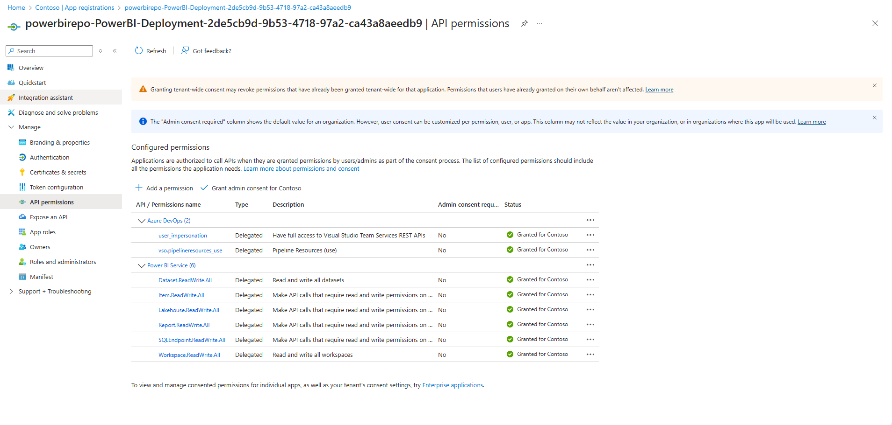

This repo is based on [https://github.com/microsoft/Analysis-Services/tree/master/pbidevmode](https://github.com/microsoft/Analysis-Services/tree/master/pbidevmode)

# Setup
## Azure Service Account

To run the Azure DevOps pipelines and call the Fabric APIs, you must authenticate with a user account or Service Principal. Learn more about service principals and how to enable them [here](https://learn.microsoft.com/en-us/power-bi/enterprise/service-premium-service-principal). After you create the service account, add Azure permissions to run DevOps pipelines and to to modify applicable Power BI content in the Power BI service, such as semantic models, workspaces, and reports. Before you can start using service principals in Power BI, an admin must [enable service principal access](https://learn.microsoft.com/en-us/power-bi/enterprise/service-premium-service-principal#enable-service-principals) in the Power BI Admin portal.

*Example Azure permissions*


## Benefits of Having Dev, Test, and Prod Branches
     
1. **Isolation of Environments:**
     - Dev Branch: Used for active development. Developers can push their changes here without affecting the stability of the test or production environments.
     - Test Branch: Used for testing new features and bug fixes. This branch allows QA teams to validate changes before they are deployed to production.
     - Prod Branch: Represents the stable version of your code that is deployed to production. Only thoroughly tested and approved changes are merged into this branch.     - 
2. **Controlled Deployment:**
     - Changes can be promoted from dev to test to prod in a controlled manner, ensuring that each change is properly tested before reaching production.       
3. **Rollback Capability:**
     - If an issue is found in production, you can quickly roll back to a previous stable state by reverting to an earlier commit in the prod branch.       
4. **Parallel Development:**
     - Multiple features can be developed in parallel in the dev branch, tested in the test branch, and then merged into the prod branch when ready.

## Example Source Control Structure

Using separate branches and workspaces for dev, test, and prod can greatly enhance your development workflow by providing clear isolation between different stages of development and deployment. It helps ensure that only thoroughly tested code reaches production, reducing the risk of issues and improving overall stability.

### Example Branching Strategy:

1. Main Branch:
     - Often used as the primary branch for production-ready code. It can be synonymous with the prod branch in some workflows.
2. Test Branch:
     - Often used as the branch for code base ready for QA testing before moving to production.
3. Dev Branch:
     - Often used as the branch for code base under collaborative development including bug fixes.
4. Feature Branches:
     - Developers create feature branches off the dev branch to work on new features or bug fixes. Once a feature is complete, it is merged back into the dev branch.
5. Release Branches
     - When a set of features is ready for testing, a release branch is created from the dev branch and merged into the test branch. After testing, it is merged into the prod branch.

### Example Repository Structure

**Repository:** PowerBI-Deployment:

- Folders
     -  Contoso Online Sales
     -  Workspace 2 
     -  Workspace 3 
     -  Workspace n 
     -  yml     

### Example Power BI Workspace Structure

Your developers and testers should have Read permissions on the workspaces because they will be working in feature branches and CI/CD will be used to promote changes to the project workspaces. The service account that you set up to run the pipelines needs to be an Admin in the workspaces.

- Power BI Workspaces:
     - Contoso Online Sales - Dev
     - Contoso Online Sales - Test
     - Contoso Online Sales - Prod
     - Workspace 2 - Dev
     - Workspace 2 - Test
     - Workspace 2 - Prod

### Example Workflow:

1. Development:
     - Developers work on feature branches and merge them into the dev branch.
2. Testing:
     - A release branch is created from the dev branch and merged into the test branch for testing.
3. Production:
     - Once testing is complete, the release branch is merged into the prod branch (or main branch).
    
# Pipelines
## Continuous Integration

The Continuous Integration pipeline is set up to run whenever there is a change in dev, test, or main. It downloads the Best Practice Analyzer (BPA) rules and runs them against the reports and semantic models committed to the Azure DevOps repo. The code that runs BPA is commented out in my Continuous Integration yml because my report and dataset do not meet the best practices, and Continuous Integration needs to succeed before the build can complete. More information about Best Practice Analyzer [here](https://docs.tabulareditor.com/te2/Best-Practice-Analyzer.html). 

## Continuous Deployment

The FabricPS-PBIP module that is used by the ContinuousDeployment.yml has a dependency to Az.Accounts module for authentication into Fabric, and this module is installed by the ContinuousDeployment.yml.

> **Note**
> This module was updated to work only with PBIP format produced by Power BI Desktop March 2024 update.

```powershell

New-Item -ItemType Directory -Path ".\modules" -ErrorAction SilentlyContinue | Out-Null

@("https://raw.githubusercontent.com/microsoft/Analysis-Services/master/pbidevmode/fabricps-pbip/FabricPS-PBIP.psm1"
, "https://raw.githubusercontent.com/microsoft/Analysis-Services/master/pbidevmode/fabricps-pbip/FabricPS-PBIP.psd1") |% {

    Invoke-WebRequest -Uri $_ -OutFile ".\modules\$(Split-Path $_ -Leaf)"
}

if(-not (Get-Module Az.Accounts -ListAvailable)) { 
    Install-Module Az.Accounts -Scope CurrentUser -Force
}

Import-Module ".\modules\FabricPS-PBIP" -Force

```

## Authentication

To call the Fabric API you must authenticate with a user account or Service Principal.

### With user account

```powershell
Set-FabricAuthToken -reset
```

### With service principal (spn)

```powershell
Set-FabricAuthToken -servicePrincipalId "[AppId]" -servicePrincipalSecret "[AppSecret]" -tenantId "[TenantId]" -reset
```


## Sample - Export items from workspace

```powershell

Export-FabricItems -workspaceId "[Workspace Id]" -path '[Export folder file path]'

```

## Sample - Import PBIP to workspace - all items

```powershell

Import-FabricItems -workspaceId "[Workspace Id]" -path "[PBIP file path]"

```

## Sample - Export item from workspace

```powershell

Export-FabricItem -workspaceId "[Workspace Id]" -itemId "[Item Id]" -path '[Export folder file path]'

```

## Sample - Import PBIP to workspace - item by item

```powershell

$semanticModelImport = Import-FabricItem -workspaceId "[Workspace Id]" -path "[PBIP Path]\[Name].SemanticModel"

# Import the report and ensure its binded to the previous imported report

$reportImport = Import-FabricItem -workspaceId $workspaceId -path "[PBIP Path]\[Name].Report" -itemProperties @{"semanticModelId"=$semanticModelImport.Id}

```

## Sample - Import PBIP item with different display name

```powershell

Import-FabricItem -workspaceId "[Workspace Id]" -path "[PBIP Path]\[Name].SemanticModel" -itemProperties @{"displayName"="[Semantic Model Name]"}

```

## Sample - Import PBIP overriding semantic model parameters

```powershell

$pbipPath = "[PBIP Path]"
$workspaceId = "[Workspace Id]"

Set-SemanticModelParameters -path "$pbipPath\[Name].SemanticModel" -parameters @{"Parameter1"= "Parameter1Value"}

Import-FabricItems -workspaceId $workspaceId -path $pbipPath

```

## Sample - Create Workspace and set permissions

```powershell

$workspaceName = "[Workspace Name]"

$workspaceId = New-FabricWorkspace  -name $workspaceName -skipErrorIfExists

$workspacePermissions = @(
    @{
    "principal" = @{
        "id" = "[User Principal Id1]"
        "type" = "user"
    }
    "role"= "Admin"
    }
    ,
    @{
    "principal" = @{
        "id" = "[User Principal Id2]"
        "type" = "user"
    }
    "role"= "Member"
    } 
)

Set-FabricWorkspacePermissions -workspaceId $workspaceId -permissions $workspacePermissions

```

## Sample - Deploy semantic model and bind to Shared Cloud Connection (SCC)

Learn more about Shared Cloud Connections [here](https://learn.microsoft.com/en-us/power-bi/connect-data/service-create-share-cloud-data-sources).

```powershell

$workspaceName = "[Workspace Name]"
$pbipPath = "[PBIP Path]\[Name].SemanticModel"
$connectionsToBind = @("[SCC Connection Id]")

## Authenticate

Set-FabricAuthToken -reset

## Ensure workspace exists

$workspaceId = New-FabricWorkspace  -name $workspaceName -skipErrorIfExists

## Import the semantic model and save the item id

$semanticModelImport = Import-FabricItem -workspaceId $workspaceId -path $pbipPath

# Bind to connections using PowerBI API - no need to specify the datasource, the service automatically maps the datasource to the connection

Write-Host "Binding semantic model to connections"

$authToken = Get-FabricAuthToken

## 'gatewayObjectId' as '00000000-0000-0000-0000-000000000000 indicate the connection is a sharable cloud.

$body = @{
    "gatewayObjectId"= "00000000-0000-0000-0000-000000000000";
    "datasourceObjectIds" = $connectionsToBind
} | ConvertTo-Json

$headers = @{'Content-Type'="application/json"; 'Authorization' = "Bearer $authToken"}

Invoke-RestMethod -Headers $headers -Uri "https://api.powerbi.com/v1.0/myorg/groups/$workspaceId/datasets/$($semanticModelImport.Id)/Default.BindToGateway" -Method Post -Body $body

```

## Sample - Invoke any Fabric API

```powershell

Import-Module ".\FabricPS-PBIP" -Force

Set-FabricAuthToken -reset

Invoke-FabricAPIRequest -uri "workspaces"

```

# Process

## Advanced
	1. Developer only works in their branch connected to their own workspace
		a. Developer opens a workspace where they have contributor permissions
		b. Developer creates a new branch based on Dev
		c. Developer makes changes in their workspace and commits to their branch
			i. The changes are saved in their workspace until they commit to their branch
			ii. A build is triggered when they commit to their branch 
	2. Developer is satisfied with their changes, and creates a PR from their branch into dev branch
		a. Dev-pipeline is triggered when they complete a pull request to dev
			i. Build
			ii. Build succeeds - files are committed to dev
               iii. Checkout dev
			iv. Deploy artifacts to dev Power BI workspace
		b. Dev workspace is in synched with dev branch 
			i. Future developers will start with the most recent version of dev
			ii. Other developers who have a prior version of dev will merge in their changes

## Basic
	1. Developers work in the Dev workspace connected to the dev branch
	2. When they are ready to save their changes with other devs they commit to dev
		a. Triggers a build  
		b. Build succeeds - files are committed to dev branch


